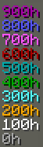
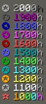

# StatsCore (v0.1)

The Library Mod required for Playtime Leaderboard.

# Playtime Leaderboard (v0.2)

A Minecraft Forge mod for version 1.19.2 & 1.20.1 that adds a `/playtime` command to display playtime statistics for all players (online and offline) on a server or singleplayer world. The mod provides a detailed, formatted leaderboard with customizable colors, podium ranks, and alignment for an enhanced user experience.

### All mods are Server-Side (not required on client)

## Features

### `/playtime` Command
- **Accessible to All Players**: Requires no permission, so anyone can use it.
- **Shows Playtime for All Players**:
  - Displays playtime for both online and offline players.
  - Hover over the hours display to see the time spent on this world today (Reset time can be edited in config)
  - Sorts players by playtime in descending order (highest to lowest).
  - Setting colors for specific usernames and blacklisting players from leaderboard is possible in the config (see `Configuration`)

### Formatting
- **Days Display**:
  - For players with 100+ hours, shows days in parentheses (e.g., `(54.17d)`).
- **Hours Decimal Display**:
  - Below 1000h: Displays hours with 2 decimal places (e.g., `493.15h`).
  - At or above 1000h: Displays hours as integers (e.g., `1300h`).
- **Color Coding**:
  
  

## Configuration (using StatsCore)
- **Config File**: `config/statscore_config.json` (DO NOT EDIT THIS FILE!)

The configuration can be edited by using the `/statscore` command (OP is required).

- **Custom Username Colors**: 
-  `/statscore color <player>` Shows the currently configured color of the specified player. 
-  `/statscore color <player> set <color>` Specify colors for specific usernames in the leaderboard.
-  `/statscore color <player> reset` Resets the color to white.

- **Blacklist Players**: Exclude specific players from the `/playtime` leaderboard.
-  `/statscore blacklist list` Shows all blacklisted players.
-  `/statscore blacklist add <player>` Adds a player to the blacklist.
-  `/statscore blacklist remove <player>` Removes a player from the blacklist.

- **Daily Reset Time**: Configure the Daily Playtime Reset Time (UTC+0).
-  `/statscore dailyresettime` Shows the currently configured time.
-  `/statscore dailyresettime <HH:mm:ss>` Changes the time to the specified time in HH:mm:ss UTC+0.

- **Reloading Config**:
-  `/statscore reload` Reloads the config.

---

## Future Plans
- Add other statistics (distance traveled, deaths, ...)

## License
- This mod is released under the [MIT License](LICENSE). Feel free to use, modify, and distribute it as per the license terms.